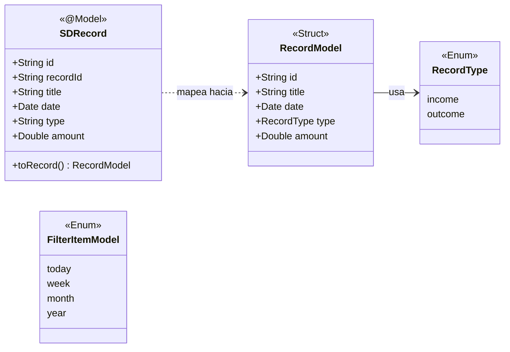

# CachiFriend

CachiFriend es una aplicación iOS nativa desarrollada en Swift y SwiftUI diseñada para ayudarte a administrar y llevar un control de tus finanzas personales (ingresos y gastos) de forma sencilla y eficiente.

## 🗂 Estructura de Directorios (Paths)

El proyecto sigue una arquitectura organizada para separar claramente la vista, la lógica de presentación, los modelos de datos y los servicios. A continuación se explica la función de cada directorio dentro de la carpeta `CachiFriend`:

- **`CachiFriendApp.swift`**: Punto de entrada (Entry Point) principal de la aplicación.
- **`Models/`**: Contiene las estructuras básicas de datos (Modelos de Dominio), como `RecordModel` y `FilterItemModel`. Estos modelos son independientes de la persistencia de datos.
- **`Services/`**: Contiene la lógica de persistencia y comunicación con bases de datos u otros servicios.
  - **`DataBase/`**: Contiene la implementación del servicio que interactúa con **SwiftData** (`SDDataBaseService.swift`).
  - **`DataBase/Entities/`**: Define los modelos persistentes de SwiftData (por ejemplo, `SDRecord.swift`).
- **`ViewModels/`**: Clases que actúan como puente entre la interfaz de usuario y los servicios. Manejan el estado de la aplicación y la lógica de negocio temporal.
- **`Views/`**: Contiene las pantallas principales de la aplicación desarrolladas con SwiftUI.
- **`Components/`**: Contiene componentes de interfaz de usuario reutilizables (ej. botones personalizados, tarjetas de registros, etc.).
- **`Utils/`**: Archivos de utilería, extensiones, formateadores de fechas, monedas u otras funciones de ayuda.
- **`Assets.xcassets/`**: Catálogo de recursos que almacena imágenes, iconos y configuraciones de colores utilizados en la app.

## 💾 Modelado de Datos (SwiftData)

El proyecto utiliza **SwiftData** para el almacenamiento local de la información de los registros financieros.

La arquitectura de la información separa el modelo de vista puro (`RecordModel`) de la entidad persistida (`SDRecord`). El servicio de base de datos (`SDDataBaseService`) se encarga de transformarlos y manejarlos utilizando el `ModelContainer` y `ModelContext` proporcionados por SwiftData.

### Diagrama de la Estructura de Datos

### Flujo de SwiftData
1. **Entidad (`SDRecord`)**: Es un `@Model` de SwiftData que incluye las propiedades que se guardan directamente en disco.
2. **Servicio (`SDDataBaseService`)**: Administra el `ModelContext` y se encarga de crear, leer (aplicando predicados para el filtro actual), actualizar y eliminar los `SDRecord`. También expone métodos como `getTotals()` para sumar ingresos y gastos.
3. **Mapeo (`toRecord()`)**: Por diseño y para mantener las vistas desacopladas de SwiftData, los `SDRecord` se convierten a un struct `RecordModel` inmutable mediante la extensión de conformidad al protocolo de conversión.

## 🚀 Requisitos

- **iOS**: Versión requerida para soportar SwiftData (iOS 17.0+ recomendado).
- **Xcode**: 15.0 o superior.

## 📄 Licencia

Este proyecto está bajo la licencia que se especifique en el archivo `LICENSE`.
